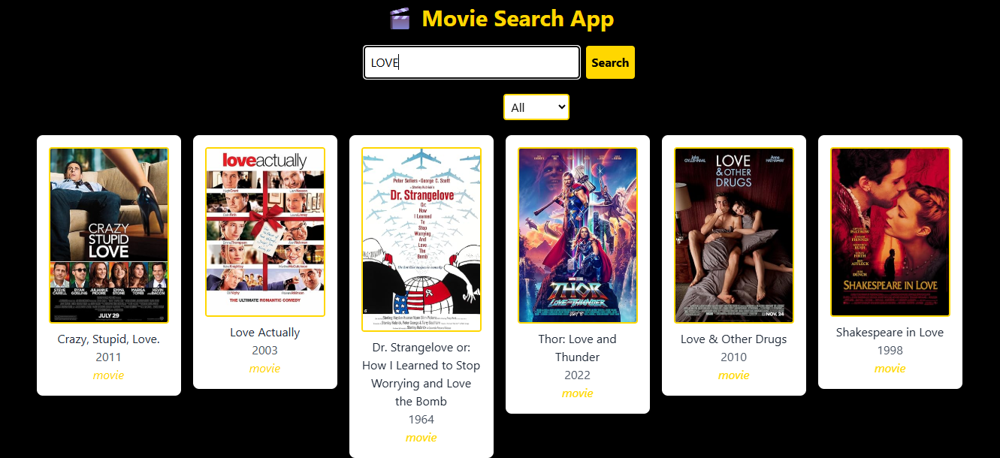

# Movie Search App

A sleek, responsive movie discovery application built with React and Tailwind CSS. Search for your favorite movies and explore detailed information with an elegant black and yellow design.

## 🌐 Live Demo

**[View Live App](https://movie-search-snowy-seven.vercel.app/)**
## 📸 Screenshot



---

## 🎬 Features

- **Movie Search**: Find movies by title or keyword
- **Detailed Movie Information**: View comprehensive movie details including:
  - High-quality movie posters
  - Release year and runtime
  - Plot summaries
  - Cast and director information
  - IMDb ratings
  - Genre classifications
- **Responsive Design**: Optimized for desktop and mobile devices
- **Dark Theme**: Elegant black background with yellow accents

## 🛠️ Technologies Used

- **React** - Frontend JavaScript library for building user interfaces
- **Tailwind CSS** - Utility-first CSS framework for styling
- **OMDb API** - Open Movie Database API for fetching movie data

## 🚀 Getting Started

### Prerequisites

Make sure you have Node.js installed on your machine:
- Node.js (version 14 or higher)
- npm or yarn package manager

### Installation

1. Clone the repository:
   ```bash
   git clone https://github.com/Alvinza/movie-search-app.git
   cd movie-search-app
   ```

2. Install dependencies:
   ```bash
   npm install
   # or
   yarn install
   ```

3. Start the development server:
   ```bash
   npm start
   # or
   yarn start
   ```

4. Open your browser and navigate to `http://localhost:3000`

## 📖 How to Use

1. **Search for Movies**: Enter a movie title in the search bar
2. **Browse Results**: View movie cards with posters and basic information
3. **View Movie Details**: Click on any movie to see detailed information
4. **Responsive Experience**: Use the app seamlessly on any device


## 📞 Contact

If you have any questions or suggestions, feel free to reach out!
- alvinzondi@gmail.com

---

**Enjoy discovering movies! 🎥**
